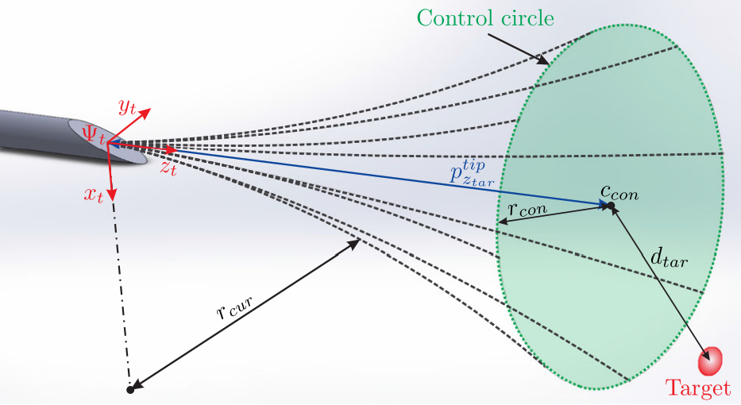
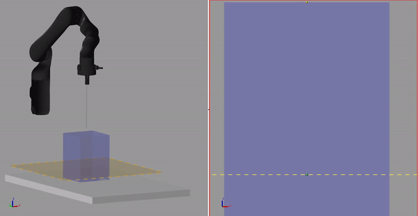
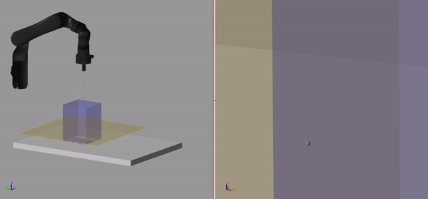
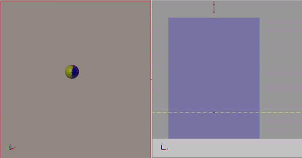

# NeedleInsertion_6DOF_Manipulator
This repo highlights some of the work I've carried out during my Master's thesis related to state estimation, specific to the application of deep tissue needle insertion. This work uses a combination of Kalman filtering and Savitzky Golay filtering to estimate rates of deflection of the needle. The estimated states are then used within a predictive framework to determine an optimal needle manipulation sequence to compensate for the bevel tip needle deflection. Source code and details will be released at a later time at the conclusion of my degree along with demonstration of experimental results.

## Bevel-Tip Needle
The asymmetric bevel-tip creates an uneven pressure distrubution surrounding the needle tip. This results in the deflection of the needle tip in a "predictable-ish" direction. Nonlinear and nonhomogeneous properties of fat and/or muscle tissue prevent the exact future direction of deflection from being know. The image below demonstrates the effect of the bevel tip needle.

## Nomenclature for demonstrations below
An "ideal" needle can be seen in silver, rigidly connected to the end-effector of the robotic manipulator. This needle does not deflect from a straight-line path due to the needle-tissue interaction. 

The red spheres, which begin coincident with the ideal needle, are used to visualize a "non-ideal" needle which deflects during the insertion into tissue. 

The blue box is the tissue, where the needle with deflect due to the bevel tip.

The yellow plane is referred to as the "target plane". It is coincident with the intended needle target and normal to the Z-Axis of the end-effector. Within the target plane there exist 4 spheres. These spheres are described below.
- Green  -> Needle target
- Yellow -> Prediction of intersection between future needle trajectory and target plane
- Blue   -> Prediction of intersection between future needle trajectory and target plane __if__ an optimal sequence is carried out from current time step onwards

- Pink   -> Possible intersection between future needle trajectory and target plane if a change in action were to be taken. This sphere constantly moves about the target plane to show all possible insertions with the target plane. Note that the blue sphere belongs to the set of points that the pink sphere moves through.

## Demonstration of needle insertion with no deflection compensation

## Demonstration of needle insertion with deflection compensation

Here the deflection compensation can be seen at work. The spheres within the target plane move unpredictably during the first few time steps when the needle first enters the blue box. Once the Kalman Filter has settled the spheres move with predictable behaviour. Once it is determined that some optimal sequence can result in the needle tip reaching some allowable space surrounding the target, the system will begin acting on that set of optimal actions which includes rotational and linear motion.

## Demonstration of needle insertion with deflection compensation (slow)

This animation is the same as above but slowed down to better illustrate what is happening with the predictions

## Close of up target plane sphere behaviour

